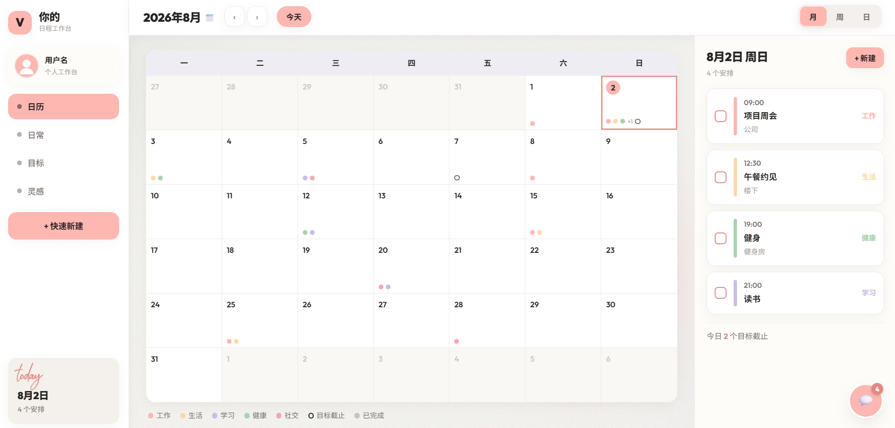
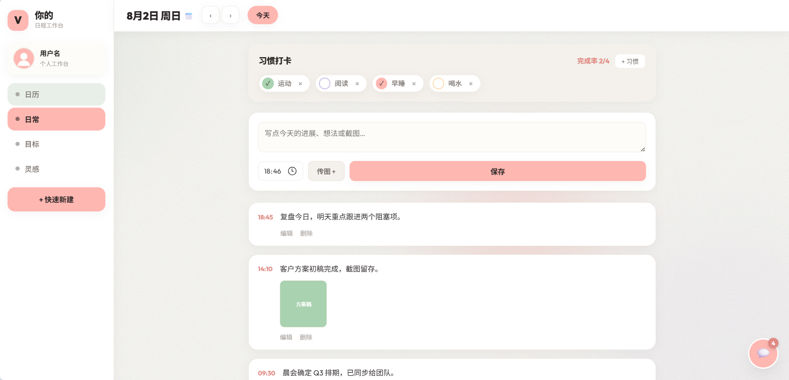
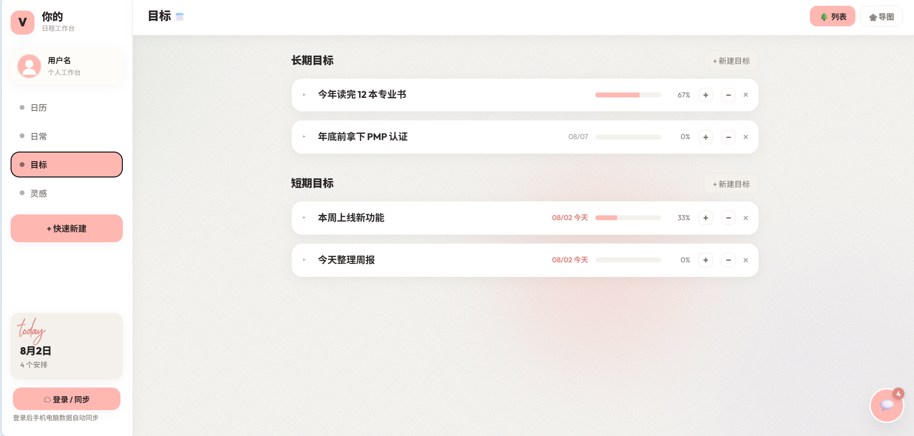
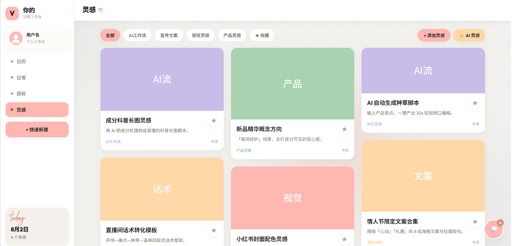

# 你的日程工作台

> AI 驱动的个人日程管理工具 — 从日历规划到习惯打卡，从目标拆解到灵感收集，一个工作台搞定。

[🖥 在线体验](https://Roviola.github.io/schedule-pages/)

---

## 功能

### 📅 日历 — 让时间一目了然

月 / 周 / 日三种视图灵活切换。工作、生活、学习、健康、社交五色分类，一天的时间分布一眼看清。点击任意日期，右侧即时显示当天的所有安排。



### ✅ 日常记录 — 每一天都值得被记住

习惯打卡 + 文字记录 + 图片上传，时间线回顾每一笔进展。页面底部自动生成今日总结，告诉你"今天节奏稳不稳"。



### 🎯 目标管理 — 把想法拆成行动

长期目标与短期目标分开管理。每个目标拆成子任务，填写"为什么重要""怎么衡量""第一步做什么""潜在风险"，进度条实时更新。



### 💡 灵感收集 — 碎片想法不再丢失

卡片墙展示 AI 工作流、宣传文案、视觉灵感和产品灵感。支持分类筛选、收藏、图片上传。想法先存下来，再慢慢整理。



---

## 技术栈

- **前端**：HTML + CSS + JavaScript，纯单页应用
- **存储**：localStorage（本地） + Supabase（云同步）
- **部署**：GitHub Pages
- **AI 协作**：四阶段推进 — 需求拆解 → 信息架构 → 模块开发 → 调试迭代

## 关于这个项目

这个日程工作台是我用 AI 辅助完成的一个全栈前端作品。从产品定位到每个模块的交互细节，我负责所有的设计决策和功能取舍，AI 帮我提高了从想法到可运行页面的效率。

## 本地运行

```bash
git clone https://github.com/Roviola/schedule-pages.git
cd schedule-pages
# 直接打开 index.html，或用本地服务器
npx serve .
```
